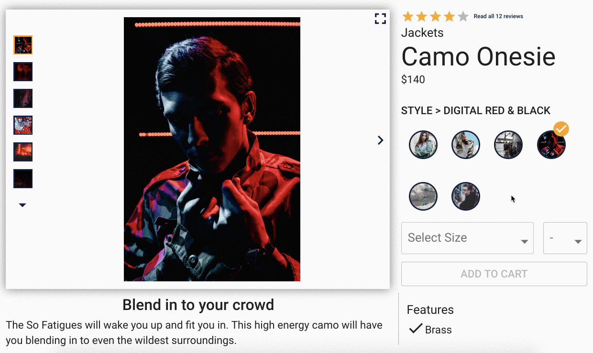
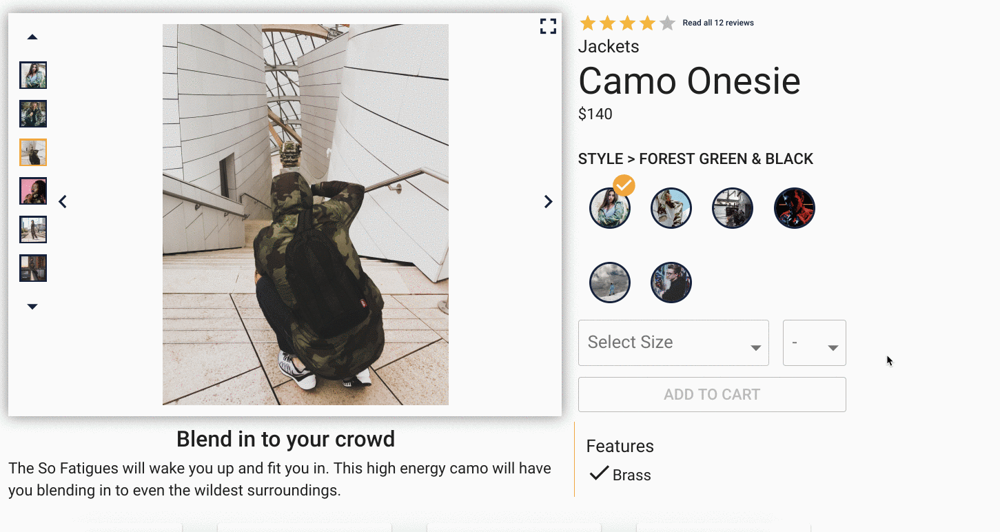

# Green Field App Documentation

<!-- INSERT GIF OF OVERALL APP HERE -->

A four person dev team created a mock shopping app focusing on the front-end using React-Redux as the primary libraries. Material-UI was leveraged for styling and icons. React-Router was used for client-side routing. This project was built in two weeks using guidelines from a mock buisness requirements document. The given data supplied to the team from an API can be viewed at the individual components [README](#Components)

> - 🎣 React Hooks - Alongside Redux, each team member implemented hooks in their component
> - 🎭 Unit, Integration and End to End tests
> - 📦 Webpack Build

## Table of Contents

1. [Installing Dependencies](#Installing-Dependencies)
2. [Technologies Used](#Technologies-Used)
3. [Requirements](#Requirements)
4. [Components](#Components)
5. [Notes](#Notes)

## Installing-Dependencies

> Navigate to the root directory and run the following scripts to run locally

- `npm install` - install dependencies
- `npm start` - start the server in production
- `npm run build` - webpack build the front end

> Alternatively run the following script to simultaneously run the server and build

- `npm run dev` - concurrently start the server and build the front end

* Navigate to http://localhost:4000/

## Technologies-Used

> Front-End

- [React](https://reactjs.org/)
- [Redux](https://redux.js.org/)
- [Material-UI](https://material-ui.com/)
- [React-Router](https://reacttraining.com/react-router/)

> Back-End

- [Node.js](https://nodejs.org/en/)
- [Express](https://expressjs.com)

> Continuous Integration

- [Travis](https://travis-ci.org/)

> Testing Suite

- [Puppeteer](https://pptr.dev/)
- [Jest](https://jestjs.io/docs/en/api)

## Requirements

Ensure that the following modules are installed before running `npm install`

- Node v10.13.0 or higher

## Components

The seperate team member was in charge of the 4 main components seen on the app. Each team member utalized the above listed technologies.

### Product Overview

> Changing Style
> 

> Add SKU to cart
> 

> Carousel Demonstration
> 

### Related

### Questions/Answers

- For more information regarding the Questions portion for this app, please refer to the [ Questions README](documentation/Questions/README.md)

### Reviews

- For more information regarding the Reviews portion for this app, please refer to the [ Reviews README](documentation/Reviews/README.md)

## Notes

> **IMPORTANT: development vs. production**
>
> - Some notes go here
