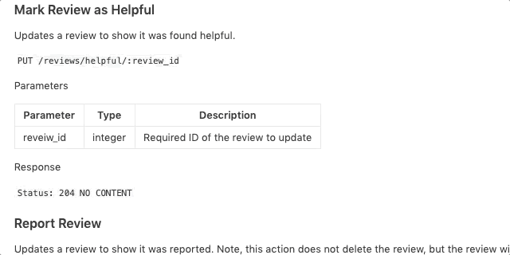

# Reviews Components

## Table of Contents

1. [Sample API](#Sample-API)

## Sample-API

To create the reviews component, GET requests needed to be made on a 2 routes. One route to get a list of all [reviews](#reviews-list) based on a productId and a second route to grab [meta-data](#meta-data-list) regarding that particular product.

The buisness requirements also specified that users be able to post a new review that can take in the following [request body](#post-new-review).

The API also handles put requests to mark as helpful or report reviews.

### reviews-list

> The reviews object

### meta-data

> Product summary data

### post-new-review

> Request body

### put-request

> Helpful reviews or report

