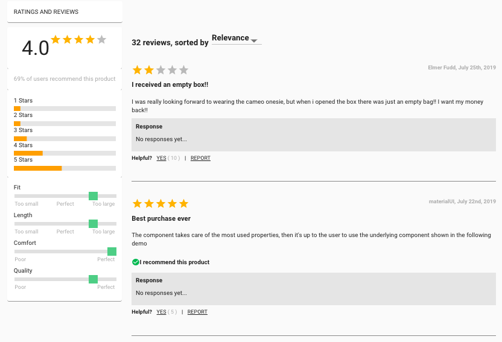
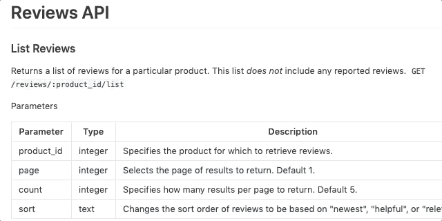
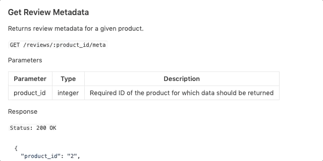
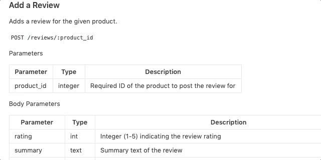
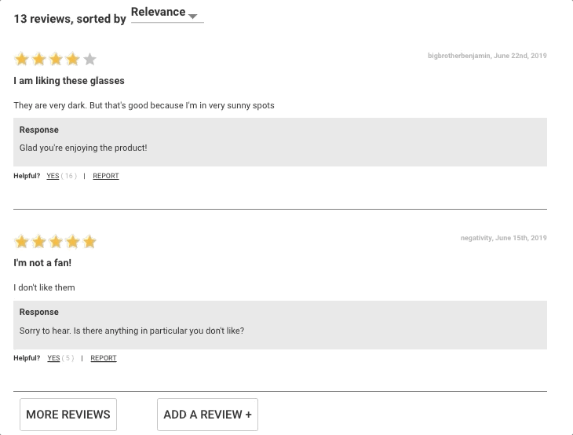

# Reviews Components Documentation

> Ensure that the installation directions and correct Node versioning specified in the [Green Field App Documentation](../../README.md).

> The component was built based on specifications listed in a mock buisness requirements document as well as a mock up by a design team. Material-UI Higher Order Components were used as general templates while additional functionality and style were added on top of the components themselves.

> The Redux store housed a reviews object containing information from the API as well as some values and actions that handled dynamic sorting and load more functionality.

> React Hooks were used as part of this project and an emphasis was placed on refactoring any class based component to functional in order set components up to use hooks during a refactor as well as trying to create a more light weight application.

## Table of Contents

1. [Sample API](#Sample-API)
2. [Reviews Component](#Reviews-Component)
   2i. [Overview-Section](#overview-section)
   2ii. [Reviews-List](#reviews-list)
   2iii. [Post-Review](#post-review)

## Sample-API

> To create the reviews component, GET requests needed to be made on a 2 routes. One route to get a list of all [reviews](#reviews-list) based on a productId and a second route to grab [meta-data](#meta-data-list) regarding that particular product.

> The buisness requirements also specified that users be able to post a new review that can take in the following [request body](#post-new-review).

> The API also handles put requests to mark as helpful or report reviews.

### reviews-list

> The reviews object

### meta-data

> Product summary data

### post-new-review

> Request body

## Reviews-Component

### overview-section

> The buisness requirements stated that an overview of the product be provided and render:
>
> - The Overall Rating (value and stars handling up to a quarter of a star)
> - % of users that recommended the product
> - A Breakdown of 1 - 5 star ratings
> - An overall average value from the different "characteristics" if they exist.

### reviews-list

> For the list of reviews, the buisness requirements requested the following:
>
> - Total No. of reviews for that product
> - Each Entry required:
>   - A star rating submitted
>   - Username
>   - Date formatted
>   - Summary
>   - Body
>   - If the user recommended the product, a checkmark and statement will render
>   - Any responses to the review
>   - An option for the client to mark a review as helpful
>   - An option to report a review
> - A default of 2 reviews listed on page load
> - Upon clicking "More Reviews", 2 more reviews will load
> - An option to "Add Review"

### post-review

